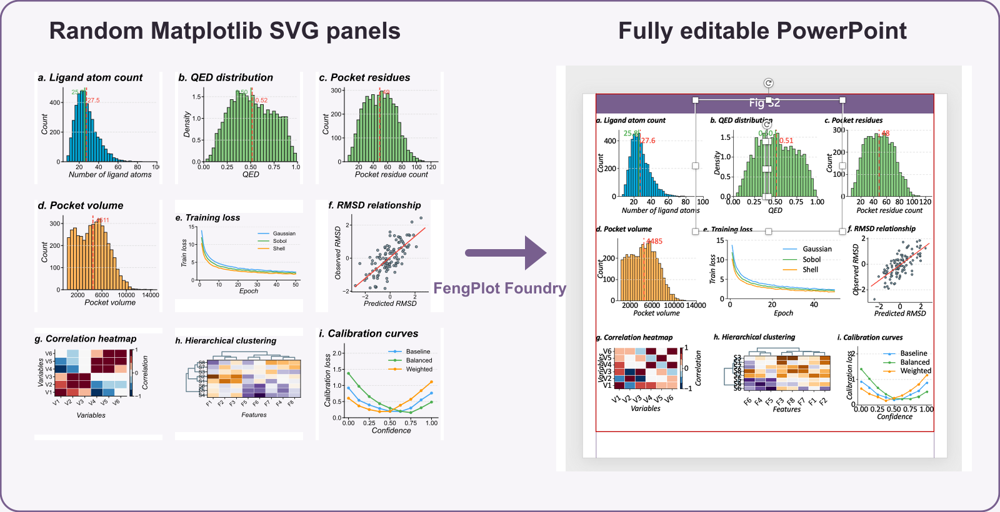

# FengPlot Foundry

FengPlot Foundry packages the scientific figure-making habits developed in my research group into a Codex-oriented workflow.



## Scope

- Designed and tested for OpenAI Codex.
- Other models, agent frameworks, and runtime environments have not been tested.
- For personal use only.
- An agent may invoke Part I, Part II, or the complete workflow according to the task.

## Two-stage workflow

### Part I — Matplotlib to standardized SVG

Generate deterministic scientific panels with native SVG text, transparent canvases, explicit axes geometry, a controlled typography system, and no raster images.

### Part II — SVG to editable PowerPoint

Convert SVG paths, markers, fills, lines, and text into native PowerPoint objects; align the panels on the bundled 56 × 56 inch template; consolidate repeated legends; and validate the final editable PPTX.

## Demo

- [Random-data SVG panels](demo/svg-panels)
- [Editable PowerPoint output](demo/fengplot-foundry-demo-editable.pptx)
- [SVG validation report](demo/svg-validation-report.txt)
- [PPTX validation report](demo/pptx-validation-report.txt)

Regenerate the SVG panels:

```bash
python3 scripts/generate_demo_svgs.py \
  --output-dir demo/svg-panels \
  --seed 20260727 \
  --count 9
```

Then assemble them with `scripts/svg_to_editable_pptx.py` following the command in `SKILL.md`.
